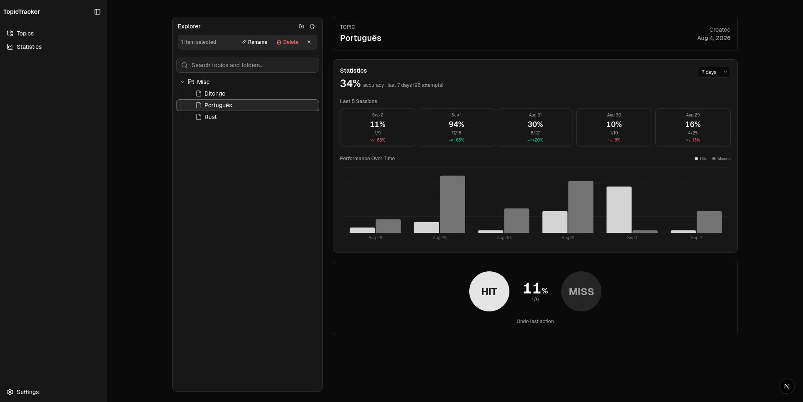
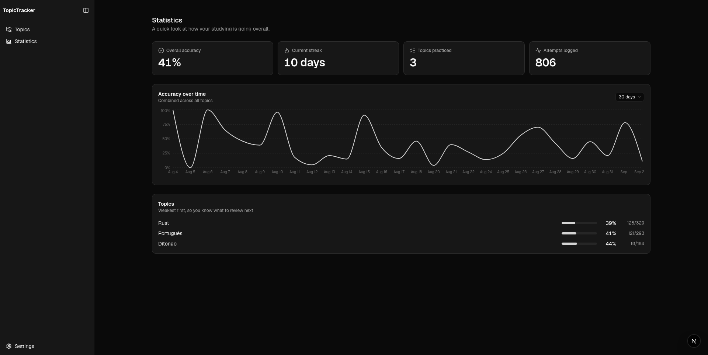

# Topic Tracker

A simple way to track what you're studying and measure your progress over time.

## Features

- **Topic tree**: organize subjects in folders and subtopics
- **Hit/miss sessions**: record whether you recalled a topic correctly or not
- **Performance tracking**: see accuracy per topic and overall over time
- **Statistics**: daily streaks, accuracy trends, and topic breakdown
- **Backup & restore**: export all your data as JSON and import it back anytime
- **Dark mode**: light, dark, and system theme support
- **Offline-first**: everything runs in your browser, no account or server needed


## Screenshots




## Getting Started

```bash
bun install
bun dev
```

## Scripts

| Command | Description |
|---------|-------------|
| `bun dev` | Start dev server |
| `bun run build` | Production build |
| `bun run lint` | Run ESLint |

## Tech

Next.js 16, React 19, Tailwind CSS, Dexie.js (IndexedDB). Fully client-side, **your data never leaves your browser.**

## License

MIT
